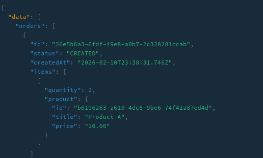

## What was added

- GraphQL endpoint: **`/graphql`** (NestJS + Apollo)
- Query **`orders(filter, pagination)`** returning `Order → items → product`
- **Product DataLoader** (per-request batching + caching) to eliminate N+1
- Code-first schema generation (`schema.gql`)

---

## 1) Schema approach

This implementation uses **code-first** (`@nestjs/graphql` decorators).

Reasons:

- The project is TypeScript-first (NestJS architecture).
- Code-first keeps entities, DTOs, validation and GraphQL schema close together.
- Reduces schema drift between implementation and contract.
- `schema.gql` is auto-generated from decorators and serves as the GraphQL contract.

---

## 2) Architecture & Business Logic Separation

### Thin Resolver

`src/modules/orders/graphql/orders.resolver.ts`

- Accepts `filter` and `pagination`
- Delegates to `OrdersService.findOrders(...)`
- Contains **no business logic**

### Service Layer

`src/modules/orders/orders.service.ts`

- Builds TypeORM QueryBuilder
- Applies:
  - status filter
  - date range filter
  - limit/offset pagination
- Returns orders with `items` relation loaded

This ensures separation of concerns:

- Resolver = transport layer
- Service = business logic
- Database access = TypeORM

---

## 3) DataLoader Implementation (N+1 removal)

### Loader

`src/loaders/product-by-id.loader.ts`

- Uses `DataLoader<string, Product>`
- Batches productId lookups
- Caches results per request

### Per-request scope

Loader is created in:

`src/graphql/graphql.module.ts`

```ts
context: () => ({
  loaders: {
    productById: createProductLoader(dataSource),
  },
})
```

## This guarantees:

Batching happens within a single GraphQL request

No cross-request caching

Product resolver

`src/modules/orders/graphql/order-item.resolver.ts`

```
@ResolveField(() => Product)
product(@Parent() item: OrderItem, @Context() ctx) {
  return ctx.loaders.productById.load(item.productId);
}
```

## N+1 Problem Before / After
Before DataLoader (classic N+1)
1 query for orders
1 query for order_items
N separate queries for products

Total queries: 1 + 1 + N

After DataLoader
Observed in SQL logs:
```
SELECT ... FROM "products"
WHERE "Product"."id" IN ($1, $2, $3)
```

Now:
1 query for orders
1 query for order_items
1 batched query for products
Total queries: 3 queries regardless of number of items
N+1 eliminated.

## How to run
Install dependencies
```
npm i
npm run seed
npm run start:dev
```
Open: 
```
http://localhost:3000/graphql
```

## Example Query
```
query Orders($filter: OrdersFilterInput, $pagination: OrdersPaginationInput) {
  orders(filter: $filter, pagination: $pagination) {
    id
    status
    createdAt
    items {
      quantity
      product {
        id
        title
        price
      }
    }
  }
}
```

